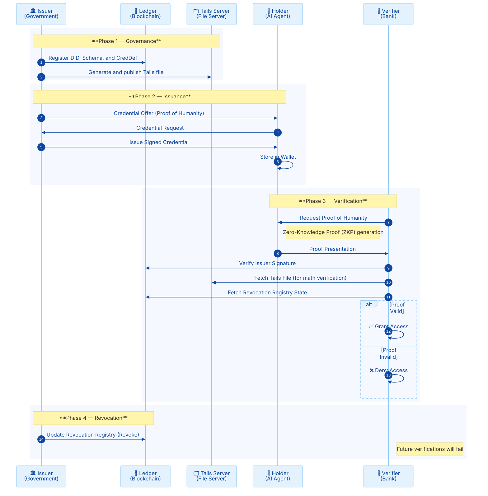

# PoC: Personhood Credentials in Open Finance

This project is a Proof of Concept (PoC) that demonstrates the application of **Personhood Credentials (PHC)** in an **Open Finance** scenario.

The goal is to validate how an **AI Agent (Bot)** can cryptographically prove it acts on behalf of a unique, legitimate human before accessing sensitive banking data, mitigating risks of automated attacks (Sybil attacks) and deepfakes.

## Architecture

The system uses a **Self-Sovereign Identity (SSI)** architecture with 3 agents running **ACA-Py (formerly Aries Cloud Agent Python)** and a **Tails Server** for revocation support:

1.  **Issuer (Government):** Trusted entity that validates the citizen's biometrics and issues the "Humanity" credential.
2.  **Holder (User's Bot):** The AI Agent that stores the credential in its digital wallet and presents it when requested.
3.  **Verifier (Bank):** The Open Finance participating institution that requires proof of personhood before granting API access.
4.  **Tails Server:** Auxiliary server essential for supporting AnonCreds credential revocation.
5.  **Ledger (Blockchain - BCovrin Testnet):** Decentralized infrastructure for public registration of DIDs, Schemas, Credential Definitions, and revocation records.

### Sequence Flow



**Technologies:**

  * Aca-py (v1.3.2 - Python 3.12)
  * DIDComm v2 protocols
  * Docker & Docker Compose
  * Ledger: BCovrin Testnet (Von-Network)
  * PostgreSQL for persistence
  * Indy Tails Server for revocation
  * Pydantic for data validation
  * pytest for automated testing

## Prerequisites

* Docker and Docker Compose installed
* Python 3.12+ installed
* Internet connection (to access the test ledger)
* curl (for API commands)

## Installation and Configuration

### 1. Clone/Prepare Directory

Ensure you are in the project root folder:
```bash
cd phc_open_finance
```

### 2. Install Controller Dependencies

The orchestration scripts use Python:

```bash
pip install -r requirements.txt
```

### 3. Start Infrastructure

Bring up the agent containers, database, and Tails Server:

```bash
docker compose up -d
```

*Wait about 15 seconds for the PostgreSQL database to fully initialize.*

### 4. Critical Step: Register the Issuer's DID

For the Government to create rules (Schemas) on the Blockchain, it needs a registered public DID.

1. **Generate the DID in the Local Agent:**

    ```bash
    # Run in terminal
    DID_RESP=$(curl -s -X POST "http://localhost:8001/wallet/did/create" -H "Content-Type: application/json" -d "{}")
    MY_DID=$(echo $DID_RESP | python3 -c "import sys, json; print(json.load(sys.stdin)['result']['did'])")
    MY_VERKEY=$(echo $DID_RESP | python3 -c "import sys, json; print(json.load(sys.stdin)['result']['verkey'])")
    echo "DID Generated: $MY_DID"
    ```

2. **Register on the Testnet (Von-Network):**

    ```bash
    curl -X POST https://test.bcovrin.vonx.io/register \
      -H "Content-Type: application/json" \
      -d "{\"did\": \"$MY_DID\", \"verkey\": \"$MY_VERKEY\", \"alias\": \"Emissor Revocable\"}"
    ```

3. **Set as Public in the Agent:**

    ```bash
    curl -X POST "http://localhost:8001/wallet/did/public?did=$MY_DID" \
      -H "Content-Type: application/json"
    ```

## Running the PoC

The PoC is divided into 5 sequential scripts that simulate the complete identity lifecycle, including revocation.

### Step 1: Establish Connections (Handshake)

Create secure communication channels (DIDComm) between Government↔Bot and Bank↔Bot.

```bash
python3 -m src.setup_connections
```

### Step 2: Configure the Issuer (Governance)

The Government registers the **Schema** (data model) and **Credential Definition** (cryptographic keys) on the Blockchain with revocation support.

```bash
python3 -m src.issuer_setup
```

### Step 3: Issue the Credential

The Government issues the credential to the Bot. The script orchestrates, ensuring the Bot accepts and saves the credential in its wallet.

```bash
python3 -m src.issue_cred
```

*Expected result: `SUMMARY: The Bot has 1 credential(s).`*

### Step 4: Verification in Open Finance

The Bank challenges the Bot ("Prove you are human"). The Bot generates a **Zero-Knowledge Proof (ZKP)** and sends it to the Bank. The Bank validates the signature on the Ledger and non-revocation status on the Tails Server.

```bash
python3 -m src.verifier_proof
```

*Expected result: `🟢 STATUS: VALID`*

### Step 5: Credential Revocation (Optional)

Demonstrates how the Government can revoke an issued credential, invalidating it for future verifications via the Tails Server.

```bash
python3 -m src.revoke_cred
```

*After revocation, run Step 4 again to verify that access is denied.*

## Tests

The project includes a comprehensive test suite to ensure the PoC's robustness:

### Test Structure

- **Unit Tests** (14 tests): Validate individual functions like `load_state()` and `get_connection_id()`
- **Integration Tests** (11 tests): Verify complete flows between agents
- **Revocation Tests** (5 tests): Ensure revoked credentials are rejected
- **Verification Tests** (1 test): Test proof validation and retry
- **Error Tests** (14 tests): Cover error paths and exceptions
- **BDD Tests** (4 scenarios): End-to-end tests using Behave/Gherkin

### Running the Tests

1. **Install Dependencies**:
   ```bash
   pip install -r requirements-test.txt
   ```

2. **Run All Tests**:

⚠️ **IMPORTANT**: Complete all steps in the "Installation and Configuration" section before running tests. Tests depend on the full infrastructure (Docker, registered DID, established connections).

   ```bash
   chmod +x run_tests.sh
   ./run_tests.sh
   ```

3. **Run Specific Categories**:
   ```bash
   pytest -m unit          # Unit only
   pytest -m integration   # Integration only
   pytest -m revocation    # Revocation only
   pytest -m verification  # Verification only
   pytest -m error         # Error tests only
   behave tests/features/  # BDD
   ```

4. **Check Coverage**:
   ```bash
   pytest --cov=src --cov-report=html
   # Open htmlcov/index.html in browser:
   # cd htmlcov
   # python3 -m http.server 8080
   # To download:
   # zip -r coverage-report.zip htmlcov/
   ```

### Test Prerequisites

- Docker Compose running with ACA-Py agents
- PostgreSQL accessible
- Tails Server active
- Internet connection (for Ledger)

### CI/CD

Tests can be integrated into GitHub Actions pipelines following the ACA-Py pattern.

### Notes

Tests follow ACA-Py best practices and use pytest with markers for categorization. Running tests requires the Docker infrastructure to be active.

## Environment Reset

If you need to restart tests from scratch (clear databases and wallets), run:

```bash
# 1. Bring down containers
docker-compose down

# 2. Remove volumes (persistent data)
sudo rm -rf wallet-db-data

# 3. Remove local script state
rm system_state.json

# 4. Restart
docker-compose up -d
```

**Note:** After a full reset, you must repeat the **DID Registration** step (item 4 of Installation).

## Project Structure

```text
projeto_phc/
├── README.md                # Documentation
├── docker-compose.yml       # Agents, Database, and Tails Server definition
├── requirements.txt         # Python dependencies
├── requirements-test.txt    # Test dependencies
├── pytest.ini               # Pytest configuration
├── run_tests.sh             # Execution script
├── LICENSE                  # Apache 2.0 License
├── src/                     # PoC Scripts
|   ├── __init__.py
|   ├── config.py            # Agent URLs and ports
|   ├── utils.py             # Helper functions
│   ├── schemas.py           # Pydantic schemas for validation
│   ├── retry.py             # Retry mechanism with backoff
|   ├── setup_connections.py # DIDComm Handshake script
|   ├── issuer_setup.py      # Ledger Registration script
|   ├── issue_cred.py        # Issuance Orchestrator
|   ├── verifier_proof.py    # Verification Orchestrator (Open Finance)
|   └── revoke_cred.py       # Revocation script
└── tests/                   # Test Suite
    ├── __init__.py
    ├── conftest.py            # Shared fixtures
    ├── test_utils.py          # Unit tests
    ├── test_schemas.py        # Pydantic schema tests
    ├── test_retry.py          # Retry mechanism tests
    ├── test_issuer_setup.py   # Issuer setup error tests
    ├── test_issue_cred.py     # Issuer cred error tests
    ├── test_verifier_proof.py # Verifier unit tests
    ├── test_integration.py    # Integration tests
    ├── test_revocation.py     # Revocation tests
    └── features/              # BDD tests
        ├── personhood_credentials.feature
        └── steps/
            └── personhood_steps.py
```

## Technical Details

### Agent Configuration

All agents use `askar-anoncreds` configuration for full AnonCreds support with revocation:

- **Wallet Type**: `askar-anoncreds`
- **Storage**: PostgreSQL with persistence
- **Ledger**: BCovrin Testnet
- **Tails Server**: Integrated for revocation support

### Credential Schema

The personhood credential has Pydantic validation for the following attributes:

- `person_hash`: Unique person hash (validated: 8-128 chars)
- `biometric_score`: Biometric score (validated: regex `^\d{1,3}(\.\d)?$`)
- `timestamp`: Timestamp (auto-generated)
- `controller_did`: Controller's DID (validated: regex `^did:sov:[a-zA-Z0-9]+$`)

### Retry Mechanism

Critical operations use retry with exponential backoff:

```python
@retry_with_backoff(max_attempts=3, initial_delay=1.0)
def send_credential_offer(payload):
    # Attempts: 1s, 2s, 4s
    # Raises exception after 3 failures
```

## Troubleshooting

### Common Issues

1. **DID not registered**: Verify step 4 of installation was executed correctly
2. **Connection failing**: Wait 15-30 seconds after starting containers
3. **Tails Server error**: Check if the `tails-server` container is running
4. **Verification timeout**: Increase wait time in script 4 if needed

### Logs and Debug

To check agent logs:
```bash
docker compose logs agent-issuer
docker compose logs agent-holder
docker compose logs agent-verifier
docker compose logs tails-server
```

## Next Steps

The PHC Project has a **solid, modern codebase**.

If you want to advance to a real product (MVP), logical next steps would be:

1. **Graphical Interface**: Create a simple frontend (React/Streamlit) to display the Bank's QR code for the user to scan
2. **Mobile Wallet**: Test connection using a real mobile wallet (like Lissi or BC Wallet) in place of `agent-holder` (Bot)
3. **Production**: Migrate to a production ledger and implement proper security
4. **Scalability**: Implement multi-tenancy and load balancing
5. **Compliance**: Add compliance with Open Finance regulations

## Contributing

Contributions are welcome! Please:

1. Fork the project
2. Create a branch for your feature (`git checkout -b feature/new-feature`)
3. Commit your changes (`git commit -am 'Add new feature'`)
4. Push to the branch (`git push origin feature/new-feature`)
5. Open a Pull Request

## License

This project is licensed under the Apache 2.0 License - see the [LICENSE](LICENSE) file for details.

---
